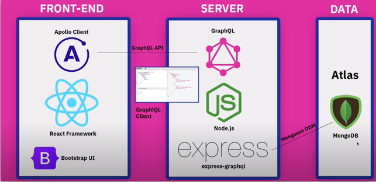

# Project management client using React and GraphQL client
Communicating with a node.js express server.



dependencies:
- @apollo/client
- graphql

## Wrapping the up into an Appolo client provider:
  
```js
import { ApolloProvider, ApolloClient, InMemoryCache } from '@apollo/client';
```

### Cache:
```js
const cache = new InMemoryCache({
  typePolicies: {
    Query: {
      fields: {
        clients: {
          merge(existing, incoming) {
            return incoming;
          },
        },
        projects: {
          merge(existing, incoming) {
            return incoming;
          },
        },
      },
    },
  },
});
```

### Appolo client:
```js
const client = new ApolloClient({
  uri: 'http://localhost:5000/graphql',
  cache,
});
```

### Wrapping the app in the Appolo provider:
```js
function App() {
  return (
    <>
      <ApolloProvider client={client}>
        <Router>
          ...
        </Router>
      </ApolloProvider>
    </>
  );
}
```

## GraphQL queries:
Example - getClients:
```js
import { gql } from '@apollo/client';

const GET_CLIENTS = gql`
  query getClients {
    clients {
      id
      name
      email
      phone
    }
  }
`;

export { GET_CLIENTS };
```

## GraphQL mutations:
Example - addClient, deleteClient:
```js
import { gql } from '@apollo/client';

const ADD_CLIENT = gql`
  mutation addClient($name: String!, $email: String!, $phone: String!) {
    addClient(name: $name, email: $email, phone: $phone) {
      id
      name
      email
      phone
    }
  }
`;

const DELETE_CLIENT = gql`
  mutation deleteClient($id: ID!) {
    deleteClient(id: $id) {
      id
      name
      email
      phone
    }
  }
`;

export { ADD_CLIENT, DELETE_CLIENT };
```

## Using the Appolo client in the components:

### GraphQL queries 
Example - projects page:
```js
import { useQuery } from '@apollo/client';
import ClientRow from './ClientRow';
import Spinner from './Spinner';
import { GET_CLIENTS } from '../queries/clientQueries';

export default function Clients() {
  const { loading, error, data } = useQuery(GET_CLIENTS);

  if (loading) return <Spinner />;
  if (error) return <p>Something Went Wrong</p>;

  return (
    <>
      {!loading && !error && (
        <table className='table table-hover mt-3'>
          <thead>
            <tr>
              <th>Name</th>
              <th>Email</th>
              <th>Phone</th>
              <th></th>
            </tr>
          </thead>
          <tbody>
            {data.clients.map((client) => (
              <ClientRow key={client.id} client={client} />
            ))}
          </tbody>
        </table>
      )}
    </>
  );
}
```

### Mutations 
Example - add a project:
```js
import { useState } from 'react';
import { FaUser } from 'react-icons/fa';
import { useMutation } from '@apollo/client';
import { ADD_CLIENT } from '../mutations/clientMutations';
import { GET_CLIENTS } from '../queries/clientQueries';

export default function AddClientModal() {
  const [name, setName] = useState('');
  const [email, setEmail] = useState('');
  const [phone, setPhone] = useState('');

  const [addClient] = useMutation(ADD_CLIENT, {
    variables: { name, email, phone },
    update(cache, { data: { addClient } }) {
      const { clients } = cache.readQuery({ query: GET_CLIENTS });

      cache.writeQuery({
        query: GET_CLIENTS,
        data: { clients: [...clients, addClient] },
      });
    },
  });

  const onSubmit = (e) => {
    e.preventDefault();

    if (name === '' || email === '' || phone === '') {
      return alert('Please fill in all fields');
    }

    addClient(name, email, phone);

    setName('');
    setEmail('');
    setPhone('');
  };

  return (
    <>
      ...
    </>
  );
}
```

## Bootstrap modals:
Example - add a client:
```js
      <button
        type='button'
        className='btn btn-secondary'
        data-bs-toggle='modal'
        data-bs-target='#addClientModal'
      >
        <div className='d-flex align-items-center'>
          <FaUser className='icon' />
          <div>Add Client</div>
        </div>
      </button>
```

Now when we click on the button we get the markup specified by the target id:

```js
      <div
        className='modal fade'
        id='addClientModal'
        aria-labelledby='addClientModalLabel'
        aria-hidden='true'
      >
      ...
      ...
      ...
          <button
          type='submit'
          data-bs-dismiss='modal'
          className='btn btn-secondary'
        >
          Submit
        </button>
```

Abowe we have the submit button which closes the modal when clicked.


### Create react app

This project was bootstrapped with [Create React App](https://github.com/facebook/create-react-app).

## Available Scripts

In the project directory, you can run:

### `npm start`

Runs the app in the development mode.\
Open [http://localhost:3000](http://localhost:3000) to view it in your browser.
